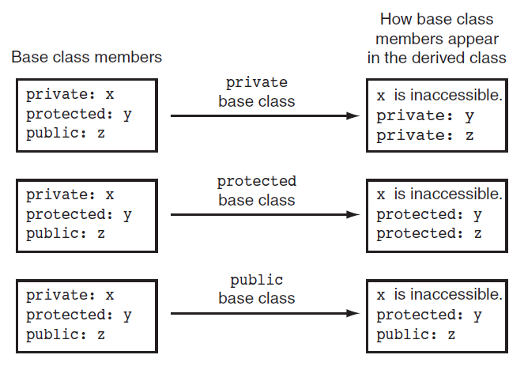

# Review Session for Section 15

## Correction and Clarification

Please read the doc that has been uploaded to Moodle. 

## Review Questions

Q1. Here is the first line of a class declaration. Circle the name of the base class:
``` cpp
class Truck : public Vehicle
```

<details>

<summary> Click me to show the answer below!</summary>

```Vehicle```
</details>


Q2. Circle the name of the derived class in the following declaration line:
``` cpp
class Truck : public Vehicle
```
<details>

<summary> Click me to show the answer below!</summary>

```Truck```
</details>

Q3. Suppose a program has the following class declarations:

``` cpp
class Shape
{
private:
  double area;
public:
  void setArea(double a)
  { area = a; }
 double getArea()
  { return area; }
};
class Circle : public Shape
{
 private:
  double radius;
 public:
  void setRadius(double r)
  { radius = r;
    setArea(3.14 * r * r); }
  double getRadius()
  { return radius; }
};
```

Answer the following questions concerning these classes:

A) When an object of the `Circle` class is created, what are its private members?

<details>

<summary> Click me to show the answer below!</summary>

```radius```
</details>


B) When an object of the `Circle` class is created, what are its public members?

<details>

<summary> Click me to show the answer below!</summary>

``` cpp
setArea
getArea
setRadius
getRadius
```
</details>

C) What members of the `Shape` class are not accessible to member functions of the `Circle class`?

<details>

<summary> Click me to show the answer below!</summary>

```
area
```
</details>

Q4. Suppose a program has the following class declaration:
``` cpp
// Declaration of CheckPoint class.
class CheckPoint
{
private:
  int a;
protected:
  int b;
  int c;
  void setA(int x) { a = x;}
public:
  void setB(int y) { b = y;}
  void setC(int z) { c = z;}
};
```
Answer the following questions regarding the class:

A) Suppose another class, `Quiz` , is derived from the `CheckPoint` class. Here is the first line of its declaration:
``` cpp
class Quiz : private CheckPoint
```
Indicate whether each member of the `CheckPoint` class is private, protected , public , or inaccessible:
``` cpp
a
b
c
setA
setB
setC
```


B) Suppose the `Quiz` class, derived from the `CheckPoint` class, is declared as
```cpp
class Quiz : protected Checkpoint
```
Indicate whether each member of the CheckPoint class is private , protected ,
public , or inaccessible:
``` cpp
a
b
c
setA
setB
setC
```

C) Suppose the Quiz class, derived from the CheckPoint class, is declared as
``` cpp
class Quiz : public Checkpoint
```
Indicate whether each member of the CheckPoint class is private , protected ,
public , or inaccessible:
``` cpp
a
b
c
setA
setB
setC
```
<details>

<summary> Click me to show the answer below!</summary>




The answer to A), B) and C) can be easily found by referring to the image above. 
</details>


D) Suppose the `Quiz` class, derived from the `CheckPoint` class, is declared as
``` cpp
class Quiz : Checkpoint
```
Is the `CheckPoint` class a private , public , or protected base class?

<details>

<summary> Click me to show the answer below!</summary>

Private
</details>


Q5. What will the following program display?
``` cpp
#include <iostream>
using namespace std;
class Sky
{
public:
  Sky()
  { cout << "Entering the sky.\n"; }
  ~Sky()
  { cout << "Leaving the sky.\n"; }
};
class Ground : public Sky
{
public:
  Ground()
  { cout << "Entering the Ground.\n"; }
  ~Ground()
  { cout << "Leaving the Ground.\n"; }
};

int main()
{
Ground object;
return 0;
}
```
<details>

<summary> Click me to show the answer below!</summary>

```cpp
Entering the sky.
Entering the Ground.
Leaving the Ground.
Leaving the sky.
```
</details>


Q6. What will the following program display?
``` cpp
#include <iostream>
using namespace std;
class Sky
{
public:
  Sky()
  { cout << "Entering the sky.\n"; }
  Sky(string color)
  { cout << "The sky is " << color << endl; }
  ~Sky()
  { cout << "Leaving the sky.\n"; }
};
class Ground : public Sky
{
public:
  Ground()
  { cout << "Entering the Ground.\n"; }
  Ground(string c1, string c2) : Sky(c1)
  { cout << "The ground is " << c2 << endl; }
  ~Ground()
  { cout << "Leaving the Ground.\n"; }
};
int main()
{
Ground object;
return 0;
}
``` 
<details>

<summary> Click me to show the answer below!</summary>

```cpp
Entering the sky.
Entering the Ground.
Leaving the Ground.
Leaving the sky.
```
</details>


# Assignment 

Q7. Design a class named `Student` . The class should keep the following information in
- Student name (a String)
- Student number (a String)
- Student Age (an int)

Write one or more constructors and the appropriate accessor and mutator functions for the class.

Next, write a class named `KpuStudent` that is derived from the `Student` class.
The `KpuStudent` class should have member variables to hold the following
information:
- Major (a String)
- Campus (a String)
- Year (an int)

 Write one or more constructors and the appropriate accessor and mutator functions for the class. Demonstrate the classes by writing a program that uses a `KpuStudent` object.


